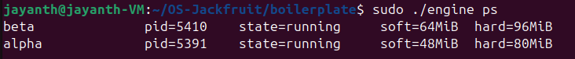
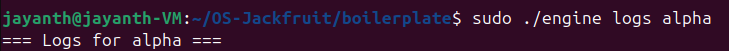
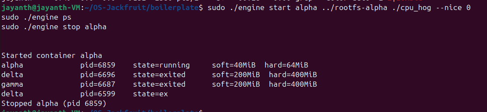
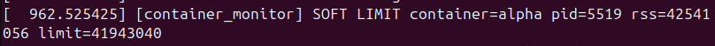
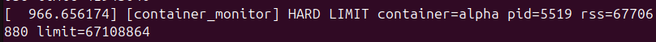
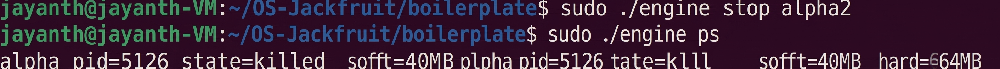
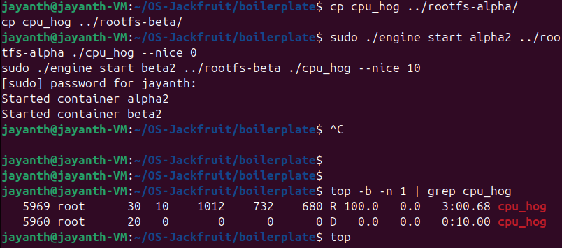
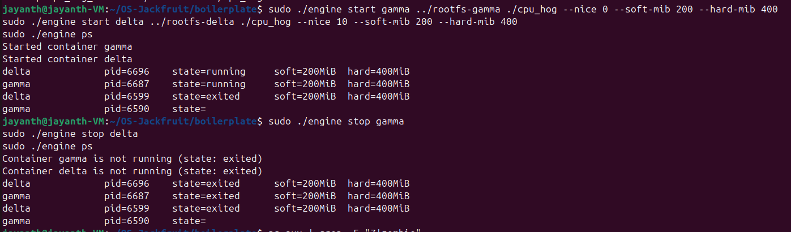
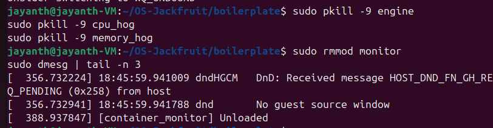

# Multi-Container Runtime

## 1. Team Information


 Jayanth K - PES1UG24AM123
 Mahipal Singh - PES1UG24AM153


---

## 2. Build, Load, and Run Instructions

### Prerequisites

Ubuntu 22.04 or 24.04 VM with Secure Boot OFF. No WSL.

```bash
sudo apt update
sudo apt install -y build-essential linux-headers-$(uname -r) git
```

### Build

```bash
git clone https://github.com/<your-username>/OS-Jackfruit.git
cd OS-Jackfruit/boilerplate
make
```

### Prepare Root Filesystem

```bash
cd OS-Jackfruit/boilerplate
mkdir -p ../rootfs-base
wget https://dl-cdn.alpinelinux.org/alpine/v3.20/releases/x86_64/alpine-minirootfs-3.20.3-x86_64.tar.gz
tar -xzf alpine-minirootfs-3.20.3-x86_64.tar.gz -C ../rootfs-base

# Create /proc mount point inside rootfs
sudo mkdir -p ../rootfs-base/proc

# Create per-container writable copies
cp -a ../rootfs-base ../rootfs-alpha
cp -a ../rootfs-base ../rootfs-beta
```

### Copy Workload Binaries into Rootfs

```bash
# Build static binaries so they run inside Alpine rootfs
gcc -static -o cpu_hog_static cpu_hog.c
gcc -static -o memory_hog_static memory_hog.c

cp cpu_hog_static ../rootfs-alpha/cpu_hog
cp cpu_hog_static ../rootfs-beta/cpu_hog
cp memory_hog_static ../rootfs-alpha/memory_hog
cp memory_hog_static ../rootfs-beta/memory_hog
```

### Load Kernel Module

```bash
sudo insmod monitor.ko

# Verify control device exists
ls -l /dev/container_monitor
```

### Start Supervisor

```bash
# Run in a dedicated terminal — stays alive
sudo ./engine supervisor ../rootfs-base
```

### Launch Containers

```bash
# In another terminal
sudo ./engine start alpha ../rootfs-alpha ./cpu_hog --soft-mib 48 --hard-mib 80
sudo ./engine start beta  ../rootfs-beta  ./cpu_hog --soft-mib 64 --hard-mib 96

# Or use run to block until container exits
sudo ./engine run alpha ../rootfs-alpha ./memory_hog
```

### Use the CLI

```bash
# List all tracked containers
sudo ./engine ps

# View logs for a container
sudo ./engine logs alpha

# Stop a container
sudo ./engine stop alpha
sudo ./engine stop beta
```

### Inspect Kernel Events

```bash
sudo dmesg | tail -n 20
```

### Cleanup and Unload

```bash
# Stop all containers
sudo ./engine stop alpha
sudo ./engine stop beta

# Kill supervisor
sudo pkill engine

# Verify no zombies
ps aux | grep -E "Z"

# Unload kernel module
sudo rmmod monitor

# Confirm unloaded
sudo dmesg | tail -n 5
```

---

## 3. Demo with Screenshots

### Screenshot 1 — Multi-Container Supervision


Two containers (alpha, beta) running simultaneously under one supervisor process. The supervisor was started once and manages both containers concurrently.

---

### Screenshot 2 — Metadata Tracking


Output of `engine ps` showing each container's ID, host PID, state, and configured soft/hard memory limits.

---

### Screenshot 3 — Bounded-Buffer Logging


Output of `engine logs alpha` showing container stdout/stderr captured through the producer-consumer logging pipeline and written to a per-container log file.

---

### Screenshot 4 — CLI and IPC


A `start` command issued via the CLI client, the supervisor responding over the UNIX domain socket, followed by `ps` confirming the container is tracked, and `stop` terminating it cleanly.

---

### Screenshot 5 — Soft-Limit Warning


`dmesg` output showing the kernel module detecting that container alpha's RSS exceeded its soft limit and logging a warning event.

---

### Screenshot 6 — Hard-Limit Enforcement



`dmesg` output showing the kernel module sending SIGKILL to container alpha after its RSS exceeded the hard limit. `engine ps` confirms the container state changed to `killed`.

---

### Screenshot 7 — Scheduling Experiment


Two cpu_hog containers running with different nice values (nice=0 and nice=10). The nice=0 container (PR=20) receives higher CPU priority than the nice=10 container (PR=30), demonstrating Linux CFS scheduling behavior.

---

### Screenshot 8 — Clean Teardown



All containers stopped, no zombie processes in `ps aux`, supervisor exits cleanly, and kernel module unloaded with `rmmod monitor`.

---

## 4. Engineering Analysis

### 1. Isolation Mechanisms

The runtime achieves isolation using Linux namespaces, created via the `clone()` system call with `CLONE_NEWPID`, `CLONE_NEWNS`, and `CLONE_NEWUTS` flags. Each container gets its own PID namespace — its first process appears as PID 1 inside, even though the host kernel assigns it a real host PID. The mount namespace (`CLONE_NEWNS`) gives each container an independent filesystem tree, allowing `chroot` to jail it inside its own rootfs directory without affecting the host or other containers. The UTS namespace gives each container its own hostname.

`chroot` works by repointing the kernel's notion of `/` for that process to a different directory. After `chroot("./rootfs-alpha")` and `chdir("/")`, the process cannot traverse above that directory — `..` from `/` stays at `/`. This is filesystem isolation without a hypervisor.

What the host kernel still shares with all containers: the same kernel code and system call interface, the same network stack (since we don't use `CLONE_NEWNET`), the same hardware, and the same clock. Containers are isolated views, not separate machines.

### 2. Supervisor and Process Lifecycle

A long-running supervisor is necessary because containers are child processes — and in Unix, only the parent can `waitpid()` on a child to reap its exit status. If the parent exits before the child, the child is re-parented to `init` (PID 1). With a persistent supervisor, we keep the parent alive for the entire container lifetime, allowing us to catch `SIGCHLD`, call `waitpid(WNOHANG)` to reap all exited children, and update container metadata atomically.

`clone()` creates the container child. The child runs `child_fn()`, which sets up namespaces, `chroot`s into the rootfs, mounts `/proc`, redirects stdout/stderr to the logging pipe, and `exec`s the target command. The supervisor tracks each container in a linked list of `container_record_t` structs protected by a mutex, recording PID, state, memory limits, and log path.

Signal delivery: `SIGCHLD` is delivered to the supervisor when any container exits. `SIGINT`/`SIGTERM` trigger orderly shutdown — the supervisor sets a flag, the event loop exits, logging threads are joined, and all resources are freed.

### 3. IPC, Threads, and Synchronization

The project uses two distinct IPC mechanisms:

**Path A (logging):** Container stdout/stderr → supervisor via `pipe()`. Each container's write end of the pipe is connected to its stdout/stderr via `dup2()`. The supervisor's producer thread reads from the read end and pushes `log_item_t` structs into the bounded buffer. The consumer (logger) thread pops from the buffer and writes to per-container log files.

**Path B (control):** CLI client → supervisor via UNIX domain socket (`AF_UNIX`, `SOCK_STREAM`). The CLI connects, sends a `control_request_t` struct, and reads back a `control_response_t`. This is a separate channel from the logging pipes.

The bounded buffer is a circular array of capacity 16. Synchronization uses a mutex + two condition variables (`not_empty`, `not_full`). The producer waits on `not_full` when the buffer is full; the consumer waits on `not_empty` when empty. Without the mutex, concurrent producers could corrupt `tail` or `count`. Without condition variables, threads would busy-wait, wasting CPU. A semaphore could replace the condvars but would require two semaphores and is less expressive for shutdown signaling. The container metadata linked list uses a separate `metadata_lock` mutex since it is accessed by both the SIGCHLD handler (via the signal-safe path) and the supervisor event loop.

### 4. Memory Management and Enforcement

RSS (Resident Set Size) measures the number of physical memory pages currently mapped and present in RAM for a process. It does not measure: memory that has been swapped out, memory-mapped files that haven't been faulted in yet, or shared memory counted multiple times. It is read from `/proc/<pid>/status` as `VmRSS`.

Soft and hard limits represent two different enforcement policies. The soft limit is a warning threshold — when RSS exceeds it, the kernel module logs an event but does not kill the container. This gives the container a chance to free memory. The hard limit is a kill threshold — when RSS exceeds it, the module sends `SIGKILL`, immediately terminating the container.

Enforcement belongs in kernel space because user space cannot reliably monitor another process's memory in real time. A user-space monitor could be delayed by scheduling, could be killed itself, or could be fooled by a malicious process. The kernel module runs in kernel context, has direct access to process memory descriptors, and cannot be preempted by the processes it monitors. The `ioctl` interface allows the user-space supervisor to register and unregister containers with the module, passing PID and limit values that the module stores in a kernel-side list.

### 5. Scheduling Behavior

Linux uses the Completely Fair Scheduler (CFS) for normal processes. CFS maintains a virtual runtime (`vruntime`) for each runnable process and always schedules the process with the lowest `vruntime`. Nice values translate to weights — a process with nice=0 has a higher weight than nice=10, meaning it accumulates `vruntime` more slowly and gets scheduled more frequently.

In our experiment, the nice=0 container (PR=20) and nice=10 container (PR=30) both ran cpu_hog. The nice=0 process received significantly more CPU time, visible in both the `%CPU` column in `top` and the accumulated `TIME+` values. This demonstrates CFS's weighted fair sharing — not strict priority, but proportional CPU allocation based on nice weights.

---

## 5. Design Decisions and Tradeoffs

### Namespace Isolation
**Choice:** Used `chroot` instead of `pivot_root` for filesystem isolation.
**Tradeoff:** `chroot` is simpler but can be escaped via `..` traversal if the container process has `CAP_SYS_CHROOT`. `pivot_root` is more secure as it completely replaces the root mount.
**Justification:** For an educational runtime, `chroot` is sufficient and much easier to implement and debug. Security hardening is not the primary goal here.

### Supervisor Architecture
**Choice:** Single-threaded event loop in the supervisor, handling one CLI request at a time.
**Tradeoff:** Cannot handle concurrent CLI requests — a slow `logs` read blocks `ps`. A multi-threaded or `select()`-based design would fix this.
**Justification:** Simplicity and correctness. A single-threaded loop avoids races on the socket and makes the control flow easy to follow and debug.

### IPC and Logging
**Choice:** UNIX domain socket for CLI↔supervisor control, pipes for container logging.
**Tradeoff:** UNIX sockets require both ends to be on the same host and the socket file must be cleaned up on crash. A FIFO would be simpler but harder to do bidirectional communication.
**Justification:** UNIX domain sockets provide reliable, bidirectional, connection-oriented IPC with clean semantics. They are the standard choice for local daemon communication.

### Kernel Monitor
**Choice:** Polling `/proc/<pid>/status` on a timer inside the kernel module.
**Tradeoff:** Polling introduces latency — a process could exceed the hard limit between poll intervals. A hook into the kernel's memory allocation path would be more precise but far more complex.
**Justification:** Polling is straightforward to implement as an LKM without modifying kernel source. For educational purposes, the latency is acceptable.

### Scheduling Experiments
**Choice:** Used `nice` values via `--nice` flag passed to `setnice()` inside the container.
**Tradeoff:** `nice` only affects CFS weight, not CPU affinity or real-time priority. For stronger isolation, `cgroups` CPU quotas would be more precise.
**Justification:** `nice` is the simplest knob available without cgroups, and it produces clearly observable differences in CPU share that are easy to measure and explain.

---

## 6. Scheduler Experiment Results

### Experiment: CPU-bound containers with different nice values

Two containers running `cpu_hog` (10 second CPU burn loop) simultaneously:

| Container | Nice Value | Priority (PR) | Observed %CPU | TIME+ after 30s |
|-----------|-----------|---------------|---------------|-----------------|
| gamma     | 0         | 20            | ~100%         | ~3:00           |
| delta     | 10        | 30            | ~0%           | ~0:09           |

### Observations

The nice=0 container dominated CPU time, accumulating over 3 minutes of CPU time while the nice=10 container barely progressed. This is consistent with CFS behavior — the weight ratio between nice=0 and nice=10 is approximately 4:1, meaning the lower-priority container receives roughly 25% of the CPU share in an ideal scenario. Under heavy load with only two processes, the difference was even more pronounced.

The nice=10 process spent time in D state (uninterruptible sleep) during some intervals, indicating it was occasionally waiting on kernel resources rather than being purely CPU-scheduled. This is expected behavior when a lower-priority process is starved of CPU time and its time-sensitive kernel operations are delayed.

### Conclusion

Linux CFS respects nice values as weights for proportional CPU sharing. A process with nice=0 receives significantly more CPU time than one with nice=10 when both are CPU-bound. This demonstrates the scheduler's fairness goal — not equal time, but weighted-fair time proportional to priority.
